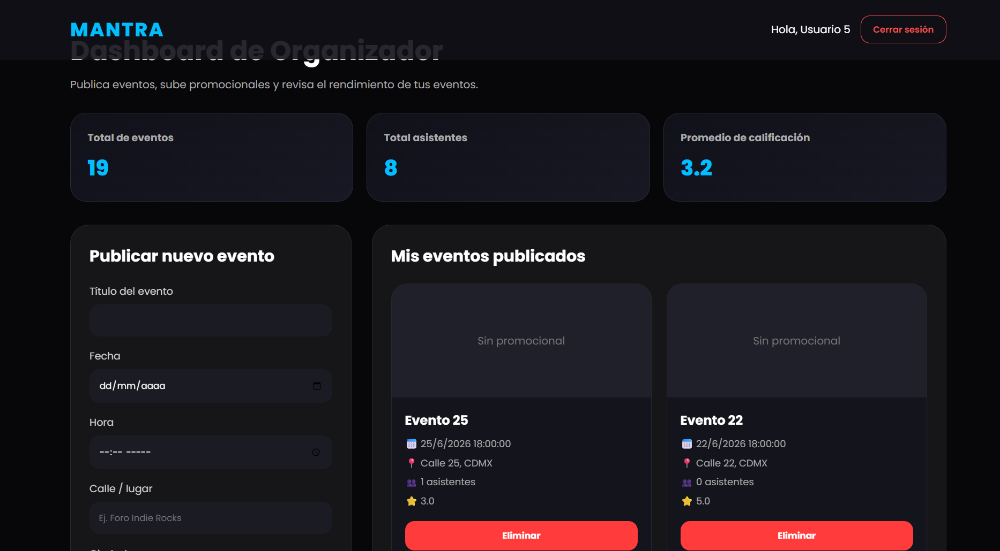
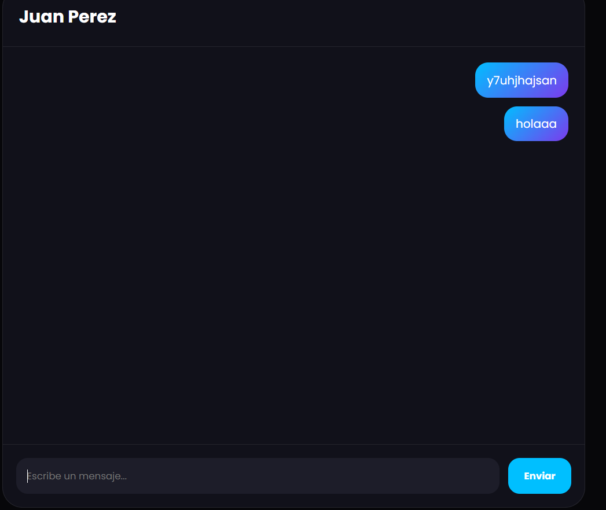
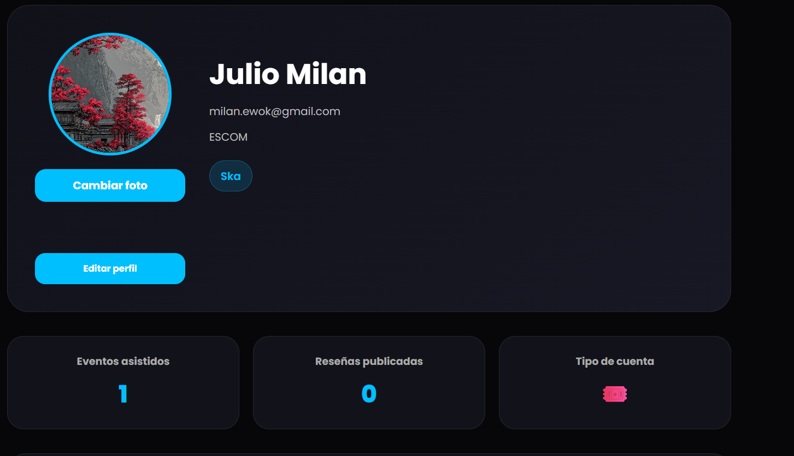

# 🎉 MANTRA - Plataforma de Gestión de Eventos (Versión Estática)

[](https://pages.github.com/)
[](https://developer.mozilla.org/es/docs/Web/JavaScript)
[](https://developer.mozilla.org/es/docs/Web/HTML)

> **Plataforma social para gestión de eventos migrada a arquitectura 100% estática. Funciona completamente en el cliente sin dependencias de backend ni base de datos.**

🔗 **[🚀 Ver Demo en Vivo (GitHub Pages)](https://julio-milan.github.io/MANTRA-ESTATICO/)** | 📂 **[Ver Versión con Backend](https://github.com/JULIO-MILAN/MANTRA/)**

---

##  Sobre el Proyecto

MANTRA es una plataforma web que conecta personas a través de eventos, intereses y comunidades digitales. Lo que comenzó como un proyecto con backend Node.js/Express y base de datos PostgreSQL, evolucionó hacia una **arquitectura completamente estática** que funciona 100% en el navegador.

### 💡 ¿Por qué una versión estática?
Esta migración demuestra la capacidad de **adaptación arquitectónica** y optimización de recursos:
- ✅ **Sin costos de hosting**: GitHub Pages gratuito y permanente.
- ✅ **Cero dependencias de servidor**: Sin Node.js, sin PostgreSQL, sin Render.
- ✅ **Rendimiento máximo**: Carga instantánea desde CDN.
- ✅ **Mantenimiento simplificado**: Sin despliegues de backend, sin migraciones de BD.

---

##  Stack Tecnológico

| Categoría | Tecnologías |
| :--- | :--- |
| **Frontend** | HTML5, CSS3, JavaScript (ES6+), Bootstrap |
| **Almacenamiento** | JSON (datos iniciales) + localStorage (persistencia) |
| **Arquitectura** | Client-side rendering (CSR) puro |
| **Data Layer** | Sistema personalizado de gestión de datos en JS (`data-layer.js`) |
| **Hosting** | GitHub Pages |
| **Imágenes** | Base64 embebido / localStorage |

---

##  Funcionalidades Principales

###  **Gestión de Usuarios**
- Registro dual (asistentes y organizadores).
- Autenticación basada en archivos JSON.
- Perfiles personalizables con foto y biografía.
- Sistema de roles (Usuario, Organizador, Owner).

###  **Gestión de Eventos**
- CRUD completo de eventos con imagen promocional.
- Clasificación por categorías.
- Sistema de confirmación de asistencia.
- Reseñas y calificaciones (1-5 estrellas) con cálculo de reputación.

###  **Capa Social Completa**
- **Comunidad:** Muro de publicaciones con likes y comentarios.
- **Chat:** Mensajería privada entre usuarios.
- **Red Social:** Sistema de amistades, seguidores y notificaciones.
- **Logros:** Gamificación de la experiencia.

###  **Dashboard de Organizador**
- Estadísticas de eventos.
- Gestión de asistentes.
- Control de reputación y publicaciones.

---

##  Arquitectura de Datos

El sistema reemplaza la base de datos relacional con **19 archivos JSON** organizados en la carpeta `data/`, replicando la estructura lógica del modelo relacional original:

```text
data/
├── usuarios.json              # Autenticación y usuarios
├── organizadores.json         # Perfiles de organizador
├── participantes.json         # Perfiles de asistente
├── eventos.json               # Eventos publicados
├── categorias.json            # Categorías disponibles
├── asistencias.json           # Confirmaciones de asistencia
├── resenas.json               # Calificaciones y comentarios
├── publicaciones.json         # Muro de comunidad
├── conversaciones.json        # Chats activos
├── mensajes.json              # Historial de mensajes
├── amistades.json             # Relaciones sociales
├── notificaciones.json        # Sistema de alertas
├── logros.json                # Gamificación
└── ... (6 archivos más de relaciones)
```
**Persistencia:** Los cambios se guardan en `localStorage` del navegador, manteniendo la sesión activa entre recargas.

---

##  Cómo Usar el Proyecto

### Opción 1: Demo en Vivo (Recomendado)
Simplemente visita: **[https://TU-USUARIO.github.io/mantra/](https://TU-USUARIO.github.io/mantra/)**

### Opción 2: Ejecutar Localmente
```bash
# 1. Clona el repositorio
git clone https://github.com/TU-USUARIO/mantra.git
cd mantra

# 2. Abre index.html en tu navegador
# (O usa la extensión "Live Server" en VS Code para mejor experiencia)
```
*Nota: No requiere `npm install` ni configuración de servidor. Es 100% estático.*

---

##  Credenciales de Prueba

###  Organizador
- **Email:** `user@example.com`
- **Password:** `pass5`

###  Asistentes
- **Email:** `milan.ewok@gmail.com`
- **Password:** `Julio121086`

---

##  Estructura del Proyecto

```text
mantra/
├── index.html                    # 🏠 Landing + Login (Punto de entrada)
├── feed-eventos.html             # 📋 Listado de eventos
├── dashboard-organizador.html    # 📊 Panel de control
├── comunidad.html                # 🤝 Muro social
├── chat.html                     # 💬 Mensajería
├── social.html                   # 👥 Red social (amistades)
├── perfil.html                   # 👤 Gestión de perfil
├── registro-asistidor.html       # 📝 Registro asistente
├── registro-organizador.html     # 📝 Registro organizador
├── usuario-db.html               # 🔧 Panel de owner
├── data-layer.js                 # 🧠 Lógica de datos (reemplaza backend)
├── data/                         # 📦 19 archivos JSON
├── capturas/                     # 📸 Screenshots de la UI
├── uploads/                      # 📁 Imágenes subidas (simuladas)
└── README.md                     # 📄 Este archivo
```

---

##  Retos de Ingeniería y Soluciones

### 1️⃣ **Migración de Backend a Client-Side**
- **Reto:** Reemplazar un backend Node.js/Express + PostgreSQL con 19 tablas relacionales.
- **Solución:** Creación de `data-layer.js`, una capa de abstracción que simula consultas y operaciones CRUD usando JavaScript y JSON.
- **Aprendizaje:** Comprensión profunda de cómo funcionan los ORMs y la importancia crítica de la separación de capas.

### 2️⃣ **Persistencia sin Base de Datos**
- **Reto:** Mantener los datos entre sesiones sin un servidor PostgreSQL.
- **Solución:** Implementación de `localStorage` con serialización JSON y manejo de estados.
- **Aprendizaje:** Limitaciones y ventajas del almacenamiento local vs bases de datos reales (trade-offs).

### 3️⃣ **Gestión de Imágenes sin Servidor**
- **Reto:** Almacenar imágenes de perfil y eventos sin un servicio como Cloudinary.
- **Solución:** Conversión a Base64 y almacenamiento en localStorage.
- **Aprendizaje:** Compromisos entre rendimiento, límite de almacenamiento del navegador y funcionalidad.

### 4️⃣ **Relaciones Complejas en JSON**
- **Reto:** Replicar relaciones N:M (eventos-categorías, usuarios-amigos) sin foreign keys.
- **Solución:** Sistema de IDs referenciales y "joins" manuales en JavaScript.
- **Aprendizaje:** Valor real de las bases de datos relacionales y su optimización interna.

---

##  Próximos Pasos y Mejoras Futuras

1. **Migrar a Firebase/Supabase:** Mantener la arquitectura frontend pero con Backend-as-a-Service (BaaS) para persistencia real en la nube.
2. **Implementar PWA:** Convertir la app en Progressive Web App con capacidad de funcionamiento offline (Service Workers).
3. **Optimización de Almacenamiento:** Migrar de `localStorage` a `IndexedDB` para manejar mayor volumen de datos e imágenes sin bloquear el hilo principal.
4. **Tests Automatizados:** Agregar Jest para validar la lógica de negocio en `data-layer.js`.

---

## 📊 Capturas de Pantalla

<details>
<summary><b>🖼️ Click para ver galería completa</b></summary>
<br>

<table>
<tr>
<td align="center">
<b>Landing Page</b><br><br>

</td>

<td align="center">
<b>Feed de Eventos</b><br><br>

</td>
</tr>

<tr>
<td align="center">
<b>Dashboard Organizador</b><br><br>

</td>

<td align="center">
<b>Comunidad</b><br><br>

</td>
</tr>

<tr>
<td align="center">
<b>Chat en Tiempo Real</b><br><br>

</td>

<td align="center">
<b>Perfil de Usuario</b><br><br>

</td>
</tr>
</table>

</details>

---

## 📚 Documentación Adicional

- 📄 [Entrevista de Requerimientos](./Entrevista_MANTRA.pdf)

---

## 👨‍💻 Autor

- **Julio Milan** - [GitHub](https://github.com/julio-milan) |

> **Proyecto desarrollado demostrando evolución arquitectónica: de base de datos relacional a aplicación estática escalable y portable.**

---

## 💡 Conclusión Técnica

Este proyecto demuestra **versatilidad arquitectónica**: 
- **Versión original:** Backend robusto con PostgreSQL, ideal para producción y datos reales.
- **Versión estática:** Solución ligera, gratuita y portable, ideal para demos, portafolio y entornos con restricciones de infraestructura.

Ambas versiones cumplen los mismos requerimientos funcionales, probando que un buen diseño de software permite **adaptarse a diferentes restricciones** sin perder la esencia de la funcionalidad.
